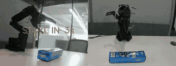

# SmolVLA Toothpaste Pick — SO101 단일 물건 픽업 파인튜닝

[`chamborgir/smolvla_pickplace_20k`](https://huggingface.co/chamborgir/smolvla_pickplace_20k) 베이스 SmolVLA 정책을 **51개 텔레오프 데모 (`toothpaste_grasp` 데이터셋)** 로 30,000 step LoRA 파인튜닝하여, **SO101 6-DOF 로봇팔이 책상 위 치약통을 집어 들어올리는** 단일 task를 성공시킨 프로젝트입니다.

> **결과 요약**
> Mac MPS 추론 환경에서 30K step 파인튜닝된 정책을 SO101 실 로봇에 띄우면 `Grasp the toothpaste box and lift it up` 지시에 100초 내내 안정적으로 grasp + lift 성공.



> 위 GIF는 [`inference_results/success_demo.mp4`](inference_results/success_demo.mp4) (1280×480 composite — left: up cam, right: side cam, 30 fps) 를 360w / 10fps / 3× speed-up 으로 압축한 미리보기.
> 풀 100 초 원본 H.264 mp4 가 같은 디렉토리에 있으니 GitHub UI에서 클릭하면 정상 속도로 재생됩니다. 촬영일자 2026-03-25 09:29 (`ep01_20260325_092949.mp4` 원본).

---

## 1. 데이터셋

`local/toothpaste_grasp` (LeRobot v2 형식, `~/.cache/huggingface/lerobot/local/toothpaste_grasp/` 에 보관)

| 항목 | 값 |
|------|-----|
| total episodes | **51** (parquet chunk file-000: 32, file-002: 15, file-003: 4 — file-001은 재정리 과정에서 제외됨) |
| total frames | 29,925 |
| fps | 30 |
| 총 영상 길이 | 약 16.6 분 |
| cameras | `observation.images.up` + `observation.images.side` (각 480 × 640) |
| state / action dim | 6 (SO101 joint: shoulder_pan, shoulder_lift, elbow_flex, wrist_flex, wrist_roll, gripper) |
| task prompt | `"Grasp the toothpaste box and lift it up"` |
| 수집 방법 | SO101 leader-follower 텔레오프 |

> 데이터셋 자체는 ~1.1 GB 라 git에 안 들어있습니다. 동일 포맷으로 직접 수집하거나 사내 공유 경로에서 받으세요.

---

## 2. 학습 설정

`configs/train_config.json` 에 학습 시점 LeRobot config 전체 스냅샷이 들어있습니다.

| 항목 | 값 |
|------|-----|
| **base policy** | `chamborgir/smolvla_pickplace_20k` (SO-100 pick-place 데이터로 20K step 사전학습된 SmolVLA) |
| **VLM backbone** | `HuggingFaceTB/SmolVLM2-500M-Video-Instruct` (frozen) |
| `train_expert_only` | True (action expert head만 갱신, VLM 동결) |
| `freeze_vision_encoder` | True |
| **steps** | 30,000 |
| **batch size** | 16 |
| **chunk_size / n_action_steps** | 50 / 50 |
| **optimizer** | AdamW (lr=1e-4, β=(0.9, 0.95), wd=1e-10, grad_clip=10) |
| **scheduler** | cosine_decay_with_warmup (warmup 1K, decay 30K, peak 1e-4 → 2.5e-6) |
| `add_image_special_tokens` | False |
| save_freq | 5,000 step |
| 학습 일자 | 2026-03-20 (output_dir: `/DATA/jeonghwanlee/lerobot/outputs/train/toothpaste_from_20k`) |
| 체크포인트 | `checkpoints/{20000, 25000, last}` 3개 보관 |

학습 명령 (참고용 — `lerobot-train` 내장 entrypoint 가정):

```bash
lerobot-train \
  --policy.type=smolvla \
  --policy.pretrained_path=chamborgir/smolvla_pickplace_20k \
  --policy.train_expert_only=true \
  --policy.freeze_vision_encoder=true \
  --policy.chunk_size=50 \
  --policy.n_action_steps=50 \
  --dataset.repo_id=local/toothpaste_grasp \
  --dataset.root=/path/to/toothpaste_grasp \
  --batch_size=16 \
  --steps=30000 \
  --optimizer.type=adamw --optimizer.lr=1e-4 --optimizer.weight_decay=1e-10 \
  --scheduler.type=cosine_decay_with_warmup \
    --scheduler.num_warmup_steps=1000 --scheduler.num_decay_steps=30000 \
    --scheduler.peak_lr=1e-4 --scheduler.decay_lr=2.5e-6 \
  --output_dir=outputs/train/toothpaste_from_20k \
  --save_freq=5000 --log_freq=200
```

---

## 3. 추론 (`scripts/run_policy.py`)

실 SO101 로봇 + 카메라 2개를 연결해 학습한 정책을 30 fps로 직접 실행하는 Mac (MPS) 스크립트.

핵심 설정 (스크립트 상단에서 수정):

```python
POLICY_PATH     = "outputs/train/toothpaste_from_20k/checkpoints/last/pretrained_model"
NORM_STATS_PATH = "outputs/train/toothpaste_from_20k/checkpoints/last/pretrained_model"

# 카메라 (학습 데이터와 키 정렬 필수)
CAMERA1_INDEX = 1   # 위에서 내려보는 카메라  → 모델 입력 "camera1" (= observation.images.up)
CAMERA2_INDEX = 0   # 측면 카메라             → 모델 입력 "camera2" (= observation.images.side)

ROBOT_PORT     = "/dev/tty.usbmodem5AE60562841"
ROBOT_ID       = "my_awesome_follower_arm"
TASK           = "Grasp the toothpaste box and lift it up"
N_EPISODES     = 3
EPISODE_TIME_S = 100
FPS            = 30
DEVICE         = "mps"
```

실행:

```bash
# lerobot 설치 환경에서
cd <lerobot fork repo>
python /path/to/scripts/run_policy.py
```

스크립트가 하는 일:
1. SO101 follower 연결, 카메라 0/1 동시 미리보기 (OpenCV 윈도우)
2. 매 step `obs.state` (joint pos) + 두 카메라 RGB 를 SmolVLA에 입력
3. action chunk (50 step) 생성 → 순차 적용
4. 에피소드별 mp4 녹화 → `recordings/ep{NN}_<timestamp>.mp4`

> 주의: 카메라 인덱스는 OS / USB 허브 순서에 따라 0/1이 뒤바뀔 수 있습니다. 학습 데이터의 `up`은 위에서 내려보는 시점이라 `CAMERA1_INDEX` 와 일치해야 합니다.

---

## 4. 데이터셋 정리 유틸 (참고)

| 스크립트 | 용도 |
|---------|------|
| `scripts/view_episodes.py` | 에피소드 mp4 재생 + 잘못 수집된 에피소드 삭제 (parquet에서 row 제거 후 재패키징) |
| `scripts/fix_camera_swap.py` | 수집 중 카메라 케이블이 뒤바뀐 ep 8~14 구간만 up ↔ side 영상 스왑 (mp4 cut + 재인코딩 + parquet 메타 수정) |

이 두 스크립트의 `DATASET_ROOT` 는 `~/.cache/huggingface/lerobot/local/toothpaste_grasp` 를 가리킵니다 — 본 repo 의 `toothpaste_from_20k` 가 학습한 바로 그 데이터셋. file-001 parquet이 누락된 51-ep 상태가 이 정리 작업의 결과물입니다.

---

## 5. 파일 트리

```
smolvla-toothpaste-pick/
├── README.md
├── .gitignore
├── scripts/
│   ├── run_policy.py            # ★ SO101 + SmolVLA 실시간 추론 (MPS)
│   ├── view_episodes.py         # 에피소드 뷰어 + 삭제
│   └── fix_camera_swap.py       # ep 8~14 카메라 스왑 수정
├── configs/
│   ├── train_config.json        # 학습 시점 LeRobot config 스냅샷 (toothpaste_from_20k)
│   └── policy_config.json       # SmolVLA policy config (chunk_size 50 등)
└── inference_results/
    ├── success_demo.mp4 (6.6 MB, 100s, 1280×480 composite) — toothpaste_from_20k 추론 성공 데모 ★
    └── success_demo.gif (4.7 MB, 360w 10fps 3× speed-up) — README 미리보기용
```

> 실제 학습 산출물 (`toothpaste_from_20k/checkpoints/{20000, 25000, last}/pretrained_model/model.safetensors` 등 ~2.5 GB) 과 데이터셋 (~1.1 GB) 은 git에 포함하지 않았습니다.

---

## 6. 주요 의존성

- [LeRobot](https://github.com/huggingface/lerobot) 0.4.x — `pip install lerobot`
- [SmolVLA](https://huggingface.co/lerobot/smolvla_base) — `lerobot/smolvla_base` 또는 본 repo가 사용한 `chamborgir/smolvla_pickplace_20k`
- PyTorch (Mac: MPS, GPU: CUDA)
- OpenCV (카메라 캡처)
- pyarrow (parquet 메타 수정 유틸용)

---

## 7. 라이선스 / 크레딧

- 본 repo 코드: 사내 사용 목적
- Base policy: [`chamborgir/smolvla_pickplace_20k`](https://huggingface.co/chamborgir/smolvla_pickplace_20k) (SO-100 pick-place 데이터 20K step)
- VLM backbone: HuggingFace SmolVLM2-500M-Video-Instruct
- 로봇 플랫폼: [SO-100/SO-101](https://github.com/TheRobotStudio/SO-ARM100) (TheRobotStudio)
