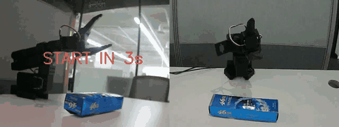
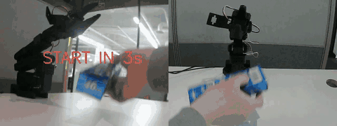
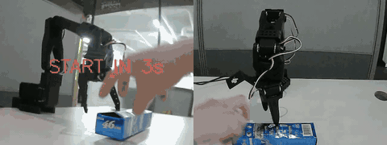

# SmolVLA Toothpaste Pick — SO101 단일 물건 픽업 파인튜닝

[`chamborgir/smolvla_pickplace_20k`](https://huggingface.co/chamborgir/smolvla_pickplace_20k) 베이스 SmolVLA 정책을 **51개 텔레오프 데모 (`local/toothpaste_grasp` 데이터셋)** 로 30,000 step 파인튜닝하여, **SO101 6-DOF 로봇팔이 책상 위 치약통을 집어 들어올리는** 단일 task를 성공시킨 프로젝트입니다.

---

## ▶︎ 결과 — 2026-03-25 09:06 ~ 09:07 세션 3 회 연속 성공

| ep01 (09:06:11) | ep02 (09:06:38) | ep03 (09:07:05) |
|:--:|:--:|:--:|
|  |  |  |
| ~19.6 s | ~19.7 s | ~19.7 s |
| [mp4](inference_results/ep01_20260325_090611.mp4) | [mp4](inference_results/ep02_20260325_090638.mp4) | [mp4](inference_results/ep03_20260325_090705.mp4) |

> 좌측 절반은 up 카메라(위에서 내려다봄), 우측 절반은 side 카메라. 원본 mp4 (1280×480 30 fps) 도 같은 디렉토리에 있어 GitHub UI에서 mp4 링크를 클릭하면 정상 속도로 재생됩니다.
>
> **핵심**: 같은 모델·같은 세션·같은 프롬프트 (`Grasp the toothpaste box and lift it up`) 로 3 회 연속 grasp + lift 성공 — 한 번이 아니라 **일관된 성공률**.

---

## 1. 파이프라인 개요

```
SO101 leader-follower 텔레오프
  → toothpaste_grasp 데이터셋 수집 (51 ep, 29,925 frame, 2-camera 30 fps)
  → 데이터 정리 (잘못 수집된 ep 삭제, ep 8~14 카메라 스왑 수정)

chamborgir/smolvla_pickplace_20k (HF, 20K step on SO-100 pickplace)
  ─[base]─→ SmolVLA fine-tune
              30,000 step / batch 16 / AdamW lr=1e-4 cosine decay
              train_expert_only=True, freeze_vision_encoder=True
  → outputs/train/toothpaste_from_20k/checkpoints/{20000, 25000, last}/

run_policy.py (Mac MPS)
  → SO101 follower + 카메라 0/1 실시간 → 30 fps 추론
  → recordings/ep{NN}_<timestamp>.mp4 (1280×480 composite up+side)
```

---

## 2. 데이터셋 — `local/toothpaste_grasp`

LeRobot v2 형식, 로컬 캐시 `~/.cache/huggingface/lerobot/local/toothpaste_grasp/` 에 보관 (~ 1.1 GB, git 미포함).

| 항목 | 값 |
|------|-----|
| total episodes | **51** |
| total frames | **29,925** |
| fps | 30 |
| 총 영상 길이 | 약 16.6 분 |
| state / action dim | 6 (SO101 joint: shoulder_pan, shoulder_lift, elbow_flex, wrist_flex, wrist_roll, gripper) |
| cameras | `observation.images.up` + `observation.images.side` (각 480 × 640) |
| task prompt | `"Grasp the toothpaste box and lift it up"` |
| episode parquet | `meta/episodes/chunk-000/file-{000,002,003}.parquet` (file-000: 32 ep, file-002: 15 ep, file-003: 4 ep — file-001은 정리 과정에서 제외됨) |
| 수집 방법 | SO101 leader-follower 텔레오프, lerobot record_persistent 류 |

### 데이터 정리 유틸 (`scripts/`)

`scripts/view_episodes.py` 와 `scripts/fix_camera_swap.py` 의 `DATASET_ROOT` 가 모두 이 데이터셋을 가리킵니다.

| 스크립트 | 용도 |
|---------|------|
| `view_episodes.py` | 에피소드 별 mp4 재생 + 잘못 수집된 ep 삭제 (parquet 메타 row 제거 + 비디오 chunk 재패키징) |
| `fix_camera_swap.py` | 수집 중 카메라 케이블이 뒤바뀐 ep 8~14 구간만 up ↔ side 영상 스왑 (mp4 cut + 재인코딩 + parquet 메타 수정) |

이 두 스크립트로 정리한 결과가 `total_episodes=51, file-001 누락` 상태입니다.

---

## 3. 학습 — `toothpaste_from_20k`

`configs/train_config.json` 에 학습 시점 LeRobot config 전체 스냅샷이 들어있습니다 (`output_dir` 기준 `/DATA/jeonghwanlee/lerobot/outputs/train/toothpaste_from_20k`, 2026-03-20 학습 완료).

### 정책 구성

| 항목 | 값 |
|------|-----|
| **base policy** | `chamborgir/smolvla_pickplace_20k` |
| **VLM backbone** | `HuggingFaceTB/SmolVLM2-500M-Video-Instruct` (frozen) |
| `train_expert_only` | `True` (action expert head만 갱신) |
| `freeze_vision_encoder` | `True` |
| `add_image_special_tokens` | `False` |
| `chunk_size / n_action_steps` | 50 / 50 |
| state norm | dataset stats 기반 (config 동봉) |

### 옵티마이저 / 스케줄러

| 항목 | 값 |
|------|-----|
| optimizer | **AdamW** (β=(0.9, 0.95), eps=1e-8, weight_decay=1e-10, grad_clip=10.0) |
| scheduler | **cosine_decay_with_warmup** |
| warmup steps | 1,000 |
| decay steps | 30,000 |
| peak lr → decay lr | 1e-4 → 2.5e-6 |

### 러너 설정

| 항목 | 값 |
|------|-----|
| **steps** | 30,000 |
| **batch size** | 16 |
| seed | 1000 |
| num_workers | 4 |
| save_freq | 5,000 step (실제 보존: `checkpoints/{20000, 25000, last}`) |
| log_freq | 200 step |
| use_policy_training_preset | True |

### 학습 명령 (참고)

```bash
lerobot-train \
  --policy.type=smolvla \
  --policy.pretrained_path=chamborgir/smolvla_pickplace_20k \
  --policy.train_expert_only=true \
  --policy.freeze_vision_encoder=true \
  --policy.chunk_size=50 \
  --policy.n_action_steps=50 \
  --dataset.repo_id=local/toothpaste_grasp \
  --dataset.root=/path/to/toothpaste_grasp \
  --batch_size=16 \
  --steps=30000 \
  --seed=1000 \
  --num_workers=4 \
  --optimizer.type=adamw --optimizer.lr=1e-4 --optimizer.weight_decay=1e-10 \
  --optimizer.grad_clip_norm=10.0 \
  --scheduler.type=cosine_decay_with_warmup \
    --scheduler.num_warmup_steps=1000 --scheduler.num_decay_steps=30000 \
    --scheduler.peak_lr=1e-4 --scheduler.decay_lr=2.5e-6 \
  --output_dir=outputs/train/toothpaste_from_20k \
  --save_freq=5000 --log_freq=200
```

> 학습 산출물 (`model.safetensors` ~865 MB × 3 checkpoints) 은 git에 포함하지 않았습니다.

---

## 4. 추론 — `scripts/run_policy.py`

실 SO101 로봇 + USB 카메라 2 개를 연결해 학습한 정책을 30 fps 로 직접 실행하는 Mac (MPS) 스크립트.

### 기본 설정 (스크립트 상단에서 수정)

```python
# ── 모델 ──
POLICY_PATH     = "outputs/train/toothpaste_from_20k/checkpoints/last/pretrained_model"
NORM_STATS_PATH = "outputs/train/toothpaste_from_20k/checkpoints/last/pretrained_model"

# ── 카메라 (학습 데이터 키와 정렬 필수) ──
CAMERA1_INDEX = 1   # 위에서 내려보는 카메라  → "camera1" (= observation.images.up)
CAMERA2_INDEX = 0   # 측면 카메라             → "camera2" (= observation.images.side)
FLIP_CAM1_HORIZONTAL = False
FLIP_CAM1_VERTICAL   = False
FLIP_CAM2_HORIZONTAL = False
FLIP_CAM2_VERTICAL   = False

# ── 그리퍼 ──
GRIPPER_SCALE = 1.2  # 학습 데이터로 norm 맞춰져 있어 별도 스케일 불필요

# ── 로봇 ──
ROBOT_PORT     = "/dev/tty.usbmodem5AE60562841"
ROBOT_ID       = "my_awesome_follower_arm"
TASK           = "Grasp the toothpaste box and lift it up"
N_EPISODES     = 3
EPISODE_TIME_S = 100
FPS            = 30
DEVICE         = "mps"
```

### 실행

```bash
# lerobot 설치 환경에서
cd <lerobot fork repo>
python /path/to/scripts/run_policy.py
```

### 동작

1. SO101 follower 연결 (Feetech STS3215 모터 6 개)
2. 카메라 0/1 동시 캡처 + OpenCV 미리보기 윈도우 표시
3. 매 step `obs.state` (joint pos 6) + 두 카메라 RGB 를 SmolVLA 에 입력
4. policy.select_action → action chunk (50 step) 생성 → 순차 적용 (30 fps)
5. 에피소드별 1280×480 mp4 녹화 → `recordings/ep{NN}_<YYYYMMDD_HHMMSS>.mp4`

### 카메라 인덱스 주의

OS / USB 허브 순서에 따라 0/1 이 뒤바뀔 수 있습니다. 학습 데이터의 `up` 은 위에서 내려보는 시점이라 `CAMERA1_INDEX` 가 그 카메라와 매칭돼야 합니다. 미리보기 창에서 확인 후 인덱스를 바꾸거나 `FLIP_*` 플래그로 보정하세요.

### 추론 환경

| 항목 | 값 |
|------|-----|
| 디바이스 | Apple Silicon Mac (MPS) |
| 추론 주파수 | 30 fps (한 step ≈ 33 ms 예산) |
| 액션 청크 | 50 step (≈ 1.67 s) — 청크 단위로 미리 생성하므로 추론 비용 분산 |
| 의존성 | `lerobot 0.4.x`, `torch` (mps 지원), `opencv-python`, `numpy` |

---

## 5. 파일 트리

```
smolvla-toothpaste-pick/
├── README.md
├── .gitignore
├── scripts/
│   ├── run_policy.py            # ★ SO101 + SmolVLA 실시간 추론 (MPS)
│   ├── view_episodes.py         # 에피소드 뷰어 + 삭제
│   └── fix_camera_swap.py       # ep 8~14 카메라 스왑 수정
├── configs/
│   ├── train_config.json        # 학습 시점 LeRobot config 전체 스냅샷
│   └── policy_config.json       # SmolVLA policy config (chunk_size 50 등)
└── inference_results/
    ├── ep01_20260325_090611.mp4 / .gif   # ★ 09:06 세션 ep01 — 성공
    ├── ep02_20260325_090638.mp4 / .gif   # ★ 09:06 세션 ep02 — 성공
    └── ep03_20260325_090705.mp4 / .gif   # ★ 09:07 세션 ep03 — 성공
```

> 실제 학습 산출물 (`toothpaste_from_20k/checkpoints/{20000, 25000, last}/pretrained_model/model.safetensors`, 각 ~865 MB) 과 데이터셋 (~ 1.1 GB) 은 git에 포함하지 않았습니다.

---

## 6. 사전 준비 / 의존성

```bash
# Python 3.10+
pip install lerobot              # 0.4.x — SmolVLA 정책 + 데이터셋 + 로봇 IO
pip install opencv-python        # 카메라 캡처 + 영상 인코딩
pip install pyarrow              # parquet 메타 수정 유틸용 (view_episodes / fix_camera_swap)
pip install torch                # Mac: MPS 자동 사용. GPU: CUDA 11.8+
```

또 필요한 것들:
- SO101 follower 로봇 (Feetech STS3215 6 모터, USB 시리얼)
- USB 카메라 2 대 (640×480 30 fps 이상 권장 — 위/옆 시점)
- HF Hub 접근 (`chamborgir/smolvla_pickplace_20k`, `HuggingFaceTB/SmolVLM2-500M-Video-Instruct` 자동 다운로드)

---

## 7. 라이선스 / 크레딧

- 본 repo 코드: 사내 사용 목적
- Base policy: [`chamborgir/smolvla_pickplace_20k`](https://huggingface.co/chamborgir/smolvla_pickplace_20k) (SO-100 pick-place 데이터 20K step)
- VLM backbone: [HuggingFaceTB/SmolVLM2-500M-Video-Instruct](https://huggingface.co/HuggingFaceTB/SmolVLM2-500M-Video-Instruct)
- 학습/추론 프레임워크: [LeRobot](https://github.com/huggingface/lerobot) (HuggingFace)
- 로봇 플랫폼: [SO-100 / SO-101](https://github.com/TheRobotStudio/SO-ARM100) (TheRobotStudio)
